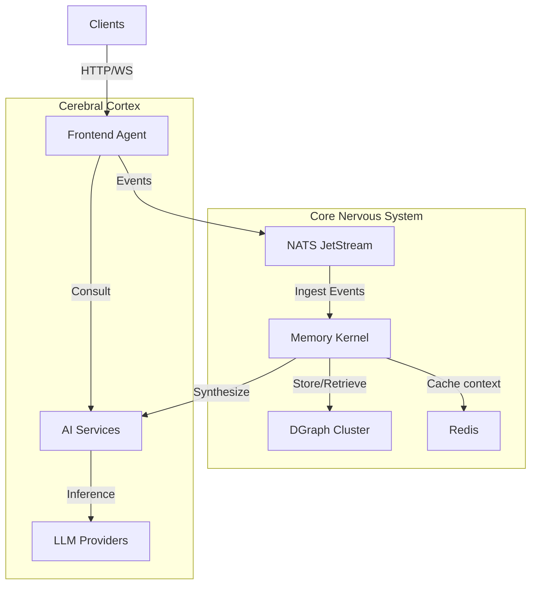

# Enterprise AI Agent Platform: Technical Whitepaper

## 1. Executive Summary
This document entails the technical architecture and implementation details of the **Enterprise AI Agent Platform**, a scalable, memory-augmented AI system designed for high-fidelity user interactions, long-term knowledge retention, and secure group collaboration.

The platform distinguishes itself through its **Memory Kernel**, a graph-based long-term memory system that employs biological memory principles (decay, reinforcement, associations) to create agents that "learn" and "forget" dynamically, rather than simply retrieving static vector embeddings.

---

## 2. System Architecture

The platform follows a microservices event-driven architecture powered by **NATS JetStream**.

### 2.1 Core Components
-   **Frontend Agent (Go)**: The gateway service handling Websocket connections, session management, and orchestrating the "Think-Act-Respond" loop.
-   **Memory Kernel (Go)**: The central nervous system. It manages the Knowledge Graph, handles ingestion pipelines, and executes memory algorithms (decay, activation).
-   **AI Services (Python)**: A FastAPI-based neuro-symbolic layer dealing with:
    -   **Extraction**: Parsing raw text into entities/triplets.
    -   **Curation**: De-duplicating and refining knowledge.
    -   **Synthesis**: Generating context-aware briefs from retrieved facts.
    -   **Routing**: Intelligent dispatch to models (Claude, GPT-4, Llama 3).

---

## 3. The Memory Kernel
Unlike vector-only systems, this platform uses a **Knowledge Graph (DGraph)** to store structured relationships, enabling logical reasoning and temporal dynamics.

### 3.1 Data Structure (The Graph)
-   **Nodes**: Represent Users, Entities (People, Places, Concepts), and Events.
-   **Edges**: Represent relationships (e.g., `User -> likes -> Entity`).
-   **Facets**: Every edge contains metadata:
    -   `activation` (0.0 - 1.0): How accessible a memory is.
    -   `confidence`: Truthfulness score.
    -   `created_at / updated_at`: Temporal grounding.

### 3.2 Memory Dynamics
The system implements biological memory features:
1.  **Activation Decay**: Memories fade over time. A decay loop runs every minute (configurable), reducing the `activation` score of unaccessed nodes.
2.  **Reinforcement (Boost)**: When a memory is accessed via chat, its activation is boosted back to 1.0. 
3.  **Dynamic Reordering**: Retrieval queries sort by `activation`. Highly reinforced memories (important facts) stay at the top; trivial facts fade into obscurity.

### 3.3 Namespacing & Isolation
Data entitlement is enforced at the graph level via **Namespaces**:
-   **User Namespace**: `user_<uuid>` (Private memory).
-   **Group Namespace**: `group_<uuid>` (Shared memory).
-   **Strict Isolation**: Retrieval queries enforce `@filter(eq(namespace, $current_namespace))`, ensuring users can never access data they don't own, even if semantically similar.

---

## 4. AI Services & LLM Routing

The `ai-services` container acts as the cognitive engine.

### 4.1 Orchestration
-   **SLM (Small Language Models)**: Used for high-speed tasks like Entity Extraction and Fact Curation.
-   **LLM (Large Language Models)** Prompt-engineered via an `LLMRouter` that dynamically selects providers (NVIDIA NIM, OpenAI, Anthropic) based on availability and task complexity.

### 4.2 Context Injection
To solve the "Model Amnesia" problem, the platform injects retrieved memories directly into the prompt stream:
1.  **Retrieval**: Kernel finds top-N relevant facts by activation.
2.  **Synthesis**: Facts are compressed into a narrative "Context Brief".
3.  **Injection**: The brief is embedded into the System Prompt or User Message, grounding the LLM's response in established truth.

---

## 5. Deployment & Configuration

The user stack is fully Dockerized for portability.

### 5.1 Docker Services
-   `rmk-frontend-agent`: Port 3000
-   `rmk-memory-kernel`: Internal
-   `rmk-ai-services`: Internal
-   `rmk-dgraph-alpha`: Port 8080 (Graph DB)
-   `rmk-nats`: Port 4222 (Message Bus)
-   `rmk-redis`: Port 6379 (Cache)

### 5.2 Environment Variables (Key Configs)
-   `DECAY_RATE`: Controls forgetting speed (default 0.5%/day).
-   `LLM_PROVIDER`: Switch between `nvidia`, `openai`, etc.
-   `DGRAPH_HOST`: Pointer to graph cluster.

---

## 6. Recent Engineering Wins (v1.2)
-   **Fixed Data Cross-Contamination**: Implemented strict namespace filtering in graph client to prevent users from linking to huge shared nodes (e.g., "India" node created by another user).
-   **Verified Recall**: End-to-end tests confirm the system creates, stores, and accurately retrieves nuanced user preferences from long-term memory.
-   **Group Architecture V2**: Migrated from a shared-list model to a robust Namespace-based model, allowing for essentially infinite scaling of group chats without data leakage.

